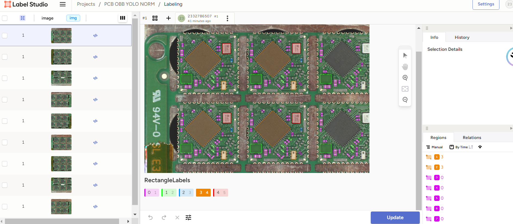

# Label_Studio教程
Label Studio 是一款**开源**数据标记工具，在一个平台上支持多个项目、用户和数据类型。本项目有[官方文档](https://labelstud.io/guide/get_started). 我提取并且概括了主要的功能, 而不必阅读大量的文档. 考虑到项目参与人员的复杂性, 本文档力求让没有编程基础的人员也能根据文档使用本工具进行数据标注.

本教程不仅仅提供Label Studio的教程,还搭配了一套数据格式转换工具,保证打通各个环节.
- - - 

### Label Studio的 优势和劣势

##### 优势:
1. 开源,免费
2. 离线,本地使用,可以选择不把数据上传到网络,数据更安全更方便
3. 有强大的社区支持,会进行持续的更新,兼容不同的机器,很多问题都可以找到解答
4. 功能全面强大,一站式服务, 可以满足各种数据类型, 各种任务的标注需求. 一旦配置好,未来可以用于其他各种任务数据集的标注.
5. 有多用户合作功能, 可以多个用户共同编辑同一个数据集,并且分配任务
6. 可以导出多种数据格式,满足不同需求
7. 有AI辅助标签功能,可以让AI来帮忙打标签,加快进度.
8. 界面清楚美观

##### 劣势:
1. 由于不是付费商业软件,无法一键安装. 然而目前市面上绝大部分主流数据标注工具都需要类似的安装流程. 本文档将会详细介绍安装流程. 
2. 自由度高, 需要有编程背景的人员根据文档把配置调整好,再交给没有背景的人使用进行数据标注. 不过有软件有默认设置, 可以缓解这一点. 本文档将一些常用的功能翻译和细化好了, 更多功能可以您自己查看[官方英文文档](https://labelstud.io/guide/get_started), 也可以联系我来进一步翻译. 

#### 鸣谢

本文档使用[mdReader](https://ooboqoo.github.io/mdreader)工具撰写

______
HUST Liu 2024.09.05 for JRS
