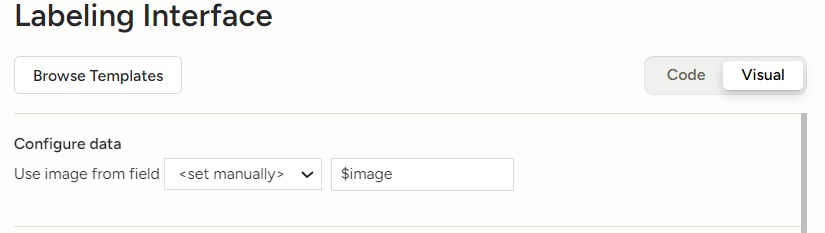
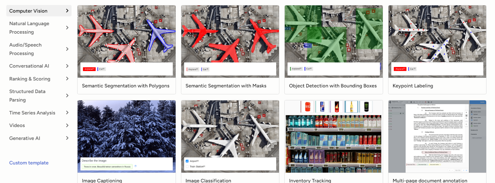
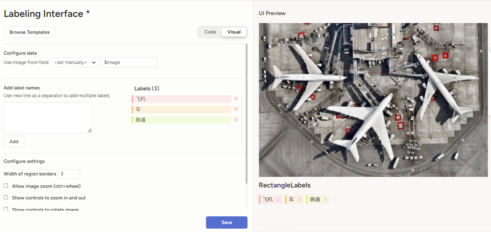
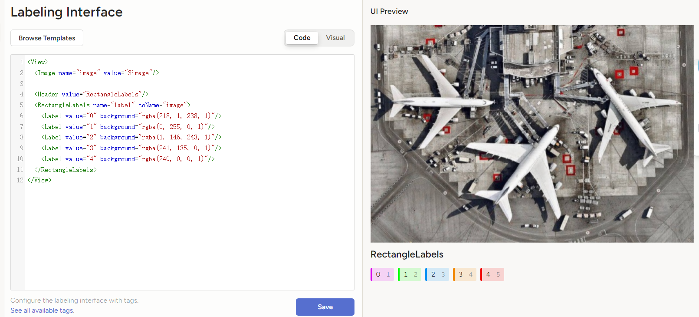

# 标签数据格式设置
当你创建完项目,导入数据之后,就要设置标签(label)的格式: 是边界框(bounding box,bbox)还是分割掩码(segmentation mask,mask)? 总共有几个类别? 每一个类别用什么颜色表示? 是否有语言描述图片的内容... 
这一部分有相当高的自由度, 可以根据官方文档自由地敲代码设置, 也可以用软件自带的UI和默认设置快速地实现.本文介绍如何使用默认设置. 

1. 创建项目之后,点击右上角的setting
2. 点击左侧的Label Interface
3. 点击Browse Templates. 

1. 在弹出的小窗口中, 根据任务类型选择标签数据格式, 例如如果要画出所有元件的边界框,则选择"Object Detection with Bounding Boxes". 这一步选什么可以问专业技术人员. 

1. 退出选择格式的小窗口之后, 在左侧调整Label类型和数量. 输入类型后点击add即可. 右侧可以看到预览.在下图中,我分了飞机\车\跑道三类

1. 点击save保存设置
2. 程序员可以点击Code转为代码模式,根据官方文档更自由地编辑标签格式. 
